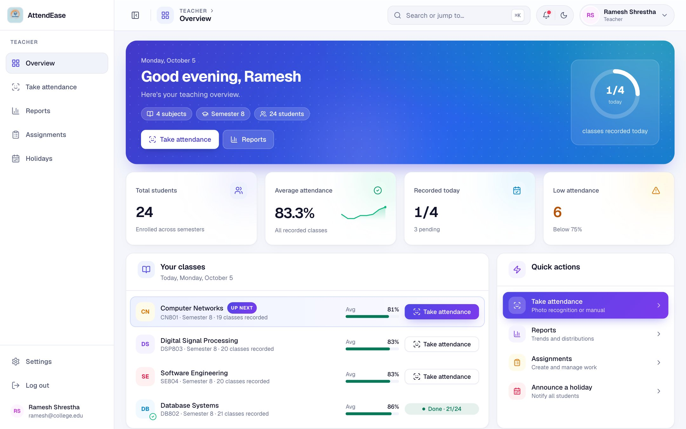
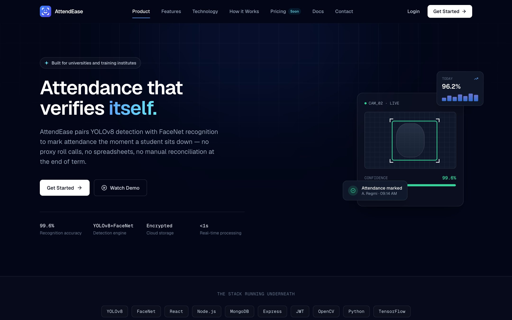
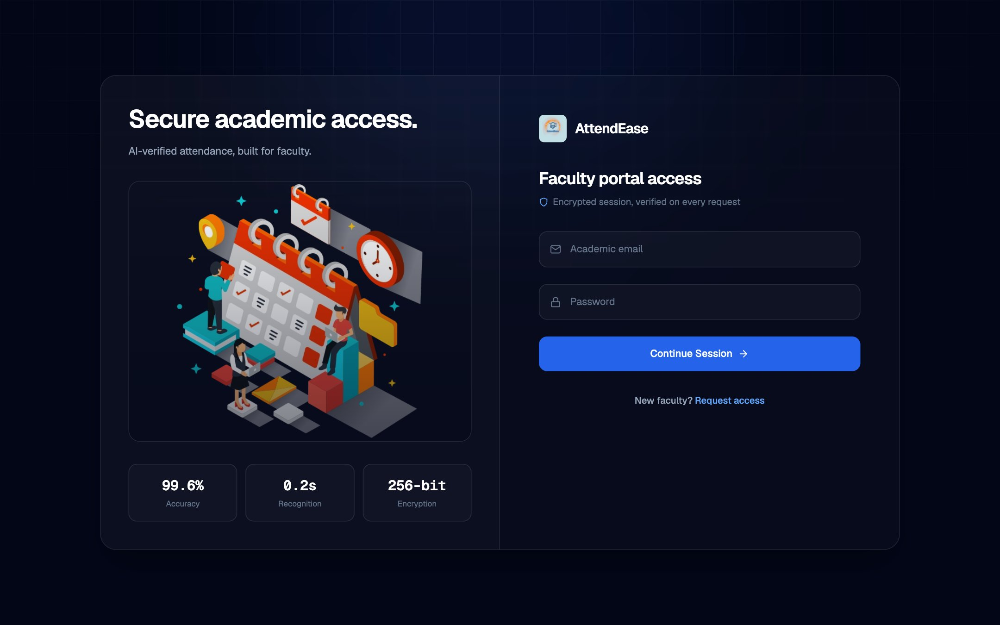
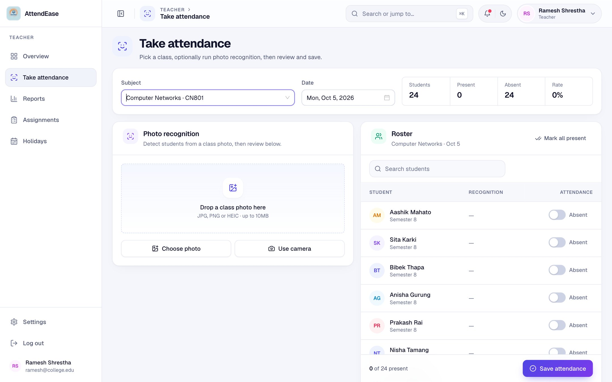
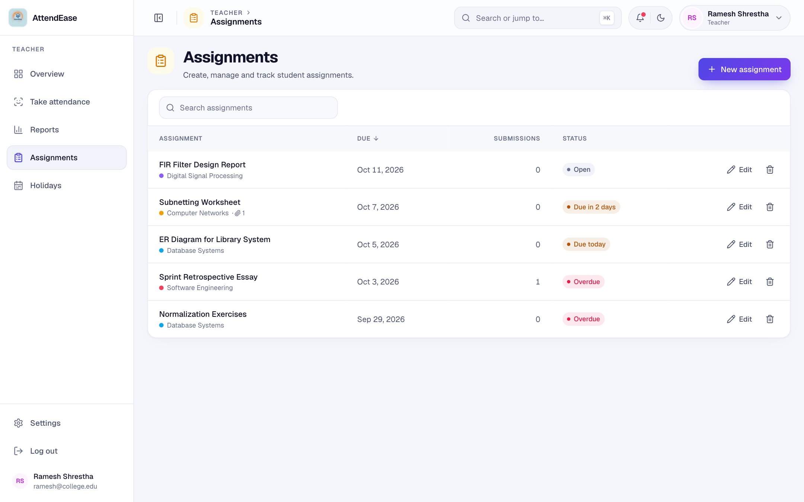
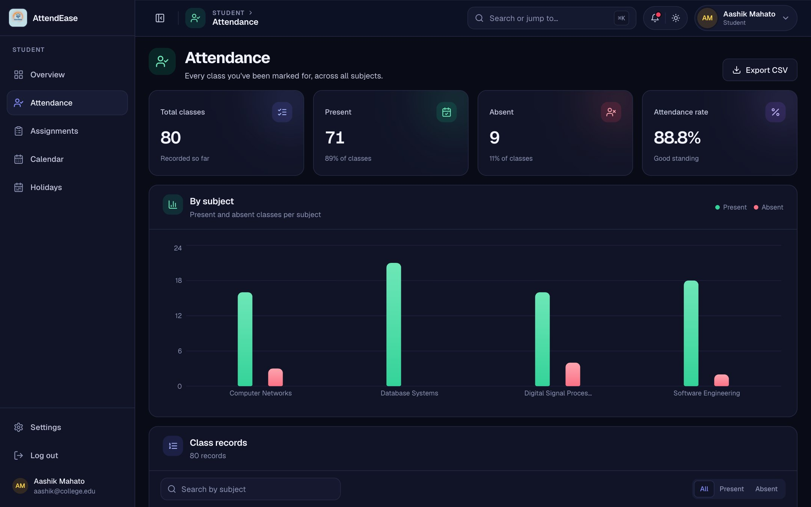

<div align="center">

# AttendEase

**Automated attendance management with face recognition.**

Take one photo of the class: AttendEase detects every face, recognizes enrolled students and fills in the roster. Teachers review and save; students track their attendance, assignments and holidays in their own dashboard.




</div>

## Contents

- [Features](#features)
- [Screenshots](#screenshots)
- [How it works](#how-it-works)
- [Tech stack](#tech-stack)
- [Project structure](#project-structure)
- [Getting started](#getting-started)
- [Face recognition setup](#face-recognition-setup)
- [Environment variables](#environment-variables)
- [API overview](#api-overview)
- [Deployment](#deployment)

## Features

### Teachers

- **Photo attendance:** upload or capture a class photo; YOLOv8 finds the faces and FaceNet matches them to enrolled students. Recognized students are marked present with a confidence score.
- **Review before saving:** a searchable roster with present/absent switches, "mark all present" and live totals, so recognition is never final until the teacher saves.
- **iPhone photos supported:** HEIC/HEIF images are converted to JPEG in the browser (with a server-side fallback).
- **Reports:** attendance trends, per-subject breakdowns, low-attendance students and CSV export.
- **Assignments:** create, edit and track assignments with due dates and file attachments.
- **Holidays:** announce holidays that appear on every student's calendar.

### Students

- **Overview:** overall attendance, classes attended and missed, monthly change, and how many more classes they can miss while staying above 75%.
- **Attendance history:** per-subject charts and a searchable record of every class.
- **Assignments:** upcoming deadlines with due-soon status.
- **Calendar:** Bikram Sambat (BS) and Gregorian (AD) views with a switch, showing holidays and assignment deadlines.

### Everyone

- Role-based dashboards (teacher / student) with JWT authentication and refresh tokens.
- Light, dark and auto themes; command menu (<kbd>⌘</kbd> <kbd>K</kbd>) to jump anywhere.
- Responsive layout: collapsible sidebar on desktop, bottom navigation on phones.
- Profile settings with avatar upload.

## Screenshots

| Landing page | Sign in |
| --- | --- |
|  |  |

| Take attendance (photo recognition + roster) | Reports |
| --- | --- |
|  |  |

| Assignments | Student overview |
| --- | --- |
|  |  |

| Calendar (BS / AD) | Dark mode |
| --- | --- |
|  |  |

> Screenshots use sample data, not real students.

## How it works

```
 Browser (React)                Node API (Express)               Face service (FastAPI)
 ───────────────                ──────────────────               ──────────────────────
 class photo ──HEIC→JPG──▶  POST /attendance/recognize ──▶  POST /recognize
                              (teacher only, JWT)              ├─ YOLOv8: detect faces
                                                               ├─ FaceNet: 512-d embeddings
                                                               ├─ cosine match vs known students
                                                               └─ archive photo (Cloudinary)
 roster pre-filled  ◀─────────  names + confidence  ◀───────────┘
 teacher reviews → POST /attendance/markattendance ──▶ MongoDB
```

The Node backend starts the Python face service automatically as a child process, waits for it to load its models and proxies requests to it. If the face service isn't set up, everything else still works and teachers can mark attendance manually.

## Tech stack

| Layer | Technologies |
| --- | --- |
| Frontend | React 18, Vite, Tailwind CSS, Ant Design 5, Framer Motion, Recharts, Zustand, React Hook Form + Zod, dayjs, nepali-date-converter, Geist font |
| Backend | Node.js, Express, MongoDB (Mongoose), JWT, Multer, Cloudinary |
| Face recognition | Python, FastAPI, Ultralytics YOLOv8 (detection), facenet-pytorch InceptionResnetV1 (embeddings), OpenCV, pillow-heif |

## Project structure

```
Automated_Attendance_Management_System/
├── Frontend/                    React app (student & teacher dashboards)
│   └── src/
│       ├── components/
│       │   ├── ui/              shared design system (Card, Button, DataTable, StatCard…)
│       │   ├── dashboard/       layout: sidebar, top bar, command menu, mobile nav
│       │   ├── dashboardComponents/
│       │   │   ├── teacherDashboardComponent/
│       │   │   └── studentDashboardComponent/
│       │   └── homeComponent/   landing page and routes
│       ├── lib/                 api client, formatting, calendar (BS/AD), HEIC helpers
│       ├── theme/               light/dark theme + Ant Design tokens
│       ├── zustand/             auth & attendance stores, protected routes
│       └── loginSignup/
├── Backend/                     Express API
│   ├── src/
│   │   ├── index.js             app entry: routes, CORS, health check, errors
│   │   ├── controllers/         request handlers
│   │   ├── models/              Mongoose schemas
│   │   ├── routes/              /api/v1/* routers
│   │   ├── middlewares/         auth, role checks, uploads
│   │   ├── services/            faceService.js (starts and proxies the face service)
│   │   └── database/ utils/
│   ├── face-service/            Python face detection + recognition
│   │   ├── app/                 FastAPI app, recognizer, config
│   │   ├── scripts/             build_embeddings.py
│   │   ├── models/              yolov8_face.pt (not in git)
│   │   └── data/                student face data (not in git)
│   └── scripts/                 setup-face-service.mjs
└── docs/screenshots/
```

## Getting started

### Prerequisites

- Node.js 18+
- A MongoDB database (local or MongoDB Atlas)
- A Cloudinary account (photo and file storage)
- Python 3.9–3.11 for face recognition (optional)

### 1. Backend

```bash
cd Backend
cp .env.example .env      # fill in MongoDB, JWT and Cloudinary values
npm install
npm run dev               # API on http://localhost:8080
```

### 2. Frontend

```bash
cd Frontend
cp .env.example .env      # VITE_API_BASE_URL=http://localhost:8080/api/v1
npm install
npm run dev               # http://localhost:5173
```

Check `http://localhost:8080/api/v1/health` to see the database and face-service status.

## Face recognition setup

Face recognition is optional; without it, attendance is marked manually.

```bash
cd Backend
npm run face:setup        # creates face-service/.venv and installs Python packages
```

1. Put the YOLOv8 face model at `Backend/face-service/models/yolov8_face.pt`.
2. Add student photos to `Backend/face-service/data/faces/<Student Name>/` (one folder per student, names matching their accounts).
3. Build the embeddings:

   ```bash
   npm run face:embeddings
   ```

4. Restart the backend, or call `POST /reload` on the face service. The service starts automatically with `npm run dev`.

See [`Backend/face-service/README.md`](Backend/face-service/README.md) for details.

> **Privacy:** model weights, face photos and embeddings are biometric data and are git-ignored. Never commit them.

## Environment variables

**Backend (`Backend/.env`)**

| Variable | Description |
| --- | --- |
| `PORT` | API port (default `8080`) |
| `MONGODB_URL` | MongoDB connection string |
| `CORS_ORIGIN` | Extra allowed frontend origins, comma-separated |
| `ACCESS_TOKEN_SECRET`, `ACCESS_TOKEN_EXPIRY` | JWT access token settings |
| `REFRESH_TOKEN_SECRET`, `REFRESH_TOKEN_EXPIRY` | JWT refresh token settings |
| `CLOUDINARY_CLOUD_NAME`, `CLOUDINARY_API_KEY`, `CLOUDINARY_API_SECRET` | File and photo storage |
| `FACE_SERVICE_AUTOSTART` | Set `false` to not start the face service |
| `FACE_SERVICE_URL` | Use a separately deployed face service instead |
| `FACE_SERVICE_KEY` | Shared secret when the face service is public |
| `FACE_DETECTION_THRESHOLD` | YOLO confidence to count a face (default `0.79`) |
| `FACE_RECOGNITION_THRESHOLD` | Max cosine distance for a match (default `0.6`) |

**Frontend (`Frontend/.env`)**

| Variable | Description |
| --- | --- |
| `VITE_API_BASE_URL` | Backend URL including `/api/v1` |

## API overview

All routes are under `/api/v1`. Protected routes need a `Bearer` access token.

| Area | Endpoints |
| --- | --- |
| Users | `POST /users/signup`, `POST /users/login`, `POST /users/logout`, `POST /users/refreshtoken`, `PATCH /users/update-profile`, `GET /users/students` |
| Subjects | `GET/POST /subjects`, `GET /subjects/:id` |
| Attendance | `POST /attendance/recognize`, `POST /attendance/markattendance`, `GET /attendance/subject/:subjectId`, `GET /attendance/student`, `PUT /attendance/update/:attendanceId`, `DELETE /attendance/delete/:attendanceId` |
| Assignments | `GET/POST /assignments`, `GET/PUT/PATCH/DELETE /assignments/:id`, `POST /assignments/:id/submit`, `PATCH /assignments/:id/submissions/:submissionId/grade` |
| Holidays | `GET/POST /holidays`, `GET/PUT/DELETE /holidays/:id` |
| Health | `GET /health` |

## Deployment

The app is deployed on [Render](https://render.com):

- **Frontend:** static site. Build command `npm install && npm run build`, publish directory `dist`, with `VITE_API_BASE_URL` set to the backend URL.
- **Backend:** web service. Build command `npm install`, start command `npm start`, with the environment variables above.
- **Face service:** runs inside the backend locally. For hosting, deploy it separately with `Backend/face-service/Dockerfile` and set `FACE_SERVICE_URL` (and `FACE_SERVICE_KEY`) on the backend.
